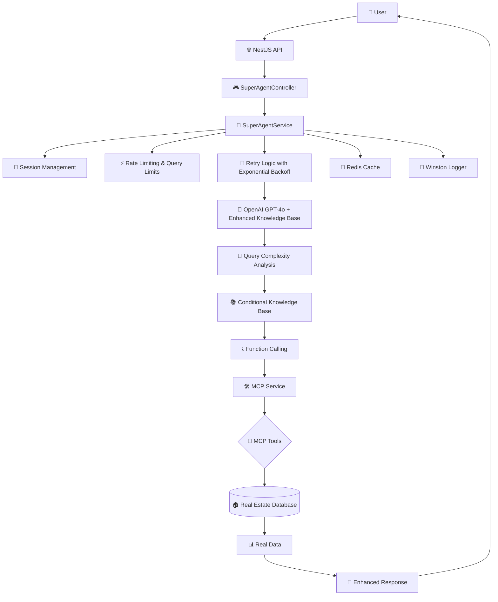
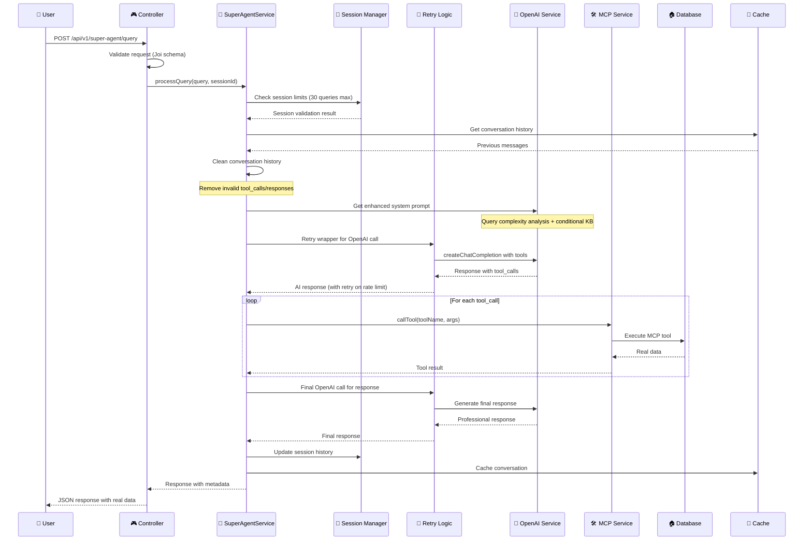
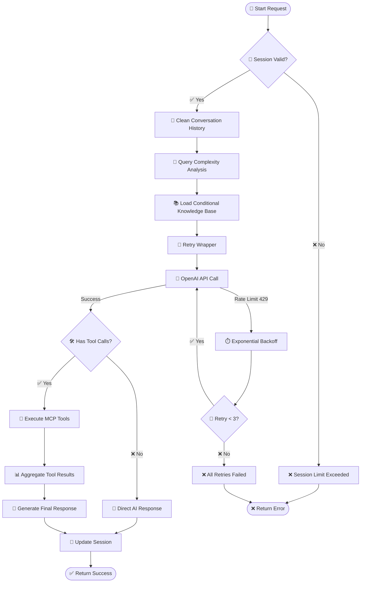
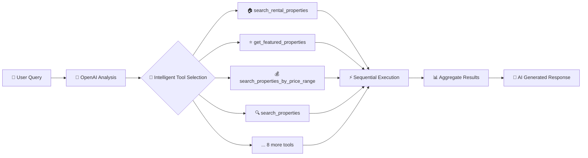
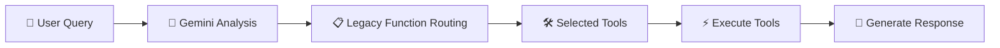
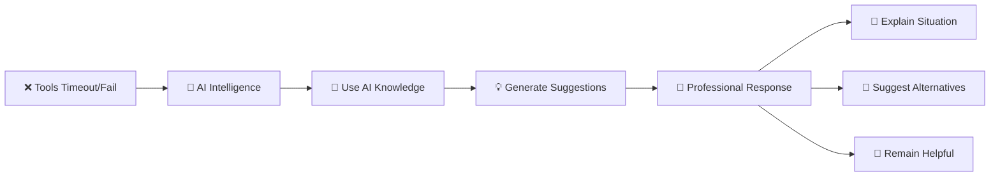
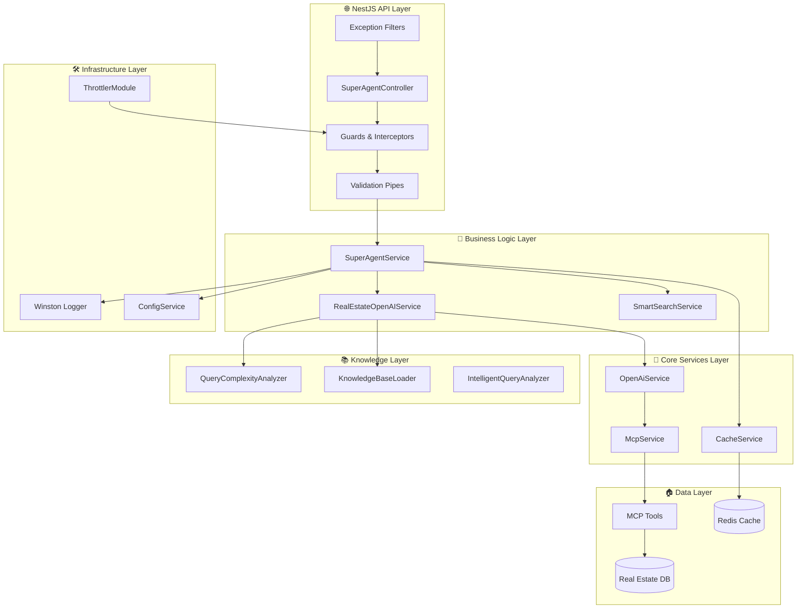
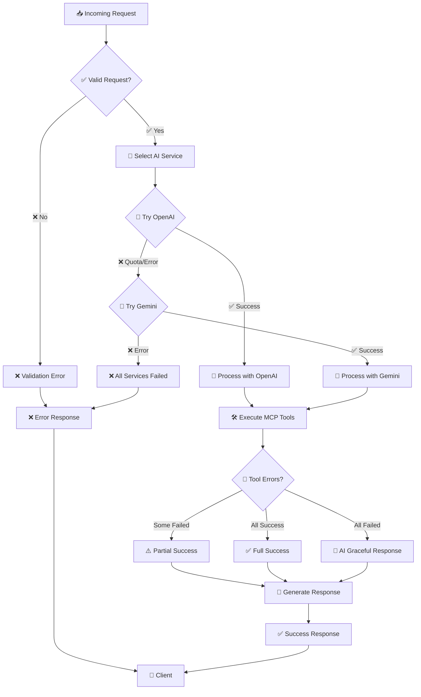
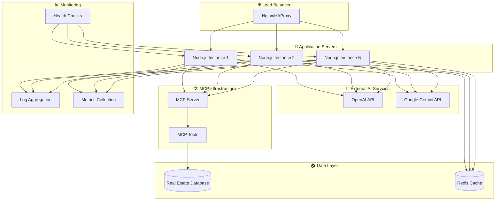
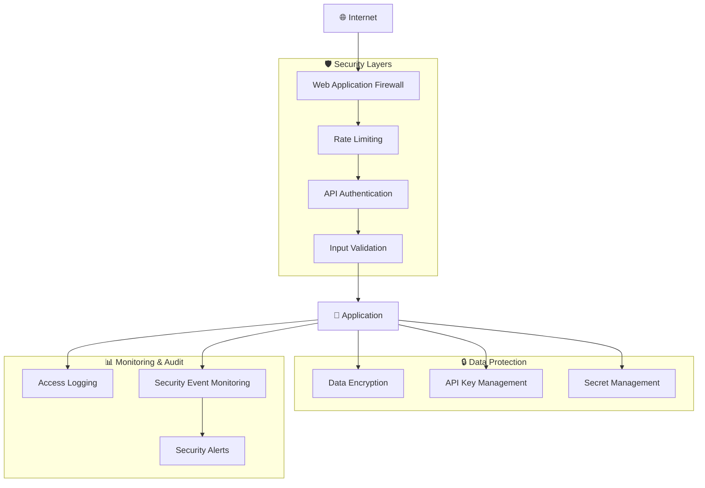

# 🏗️ Architecture Overview - AI Agent Real Estate Assistant (NestJS)

## 🎯 **SYSTEM OVERVIEW**



## 🔄 **REQUEST FLOW DIAGRAM**



## 🧩 **COMPONENT ARCHITECTURE (NestJS)**

### **NestJS Module Structure**
```
┌─────────────────────────────────────────────────────────────┐
│                      📦 AppModule                           │
│  ┌─────────────┐ ┌─────────────┐ ┌─────────────────────────┐ │
│  │ CoreModule  │ │SuperAgentMod│ │ HealthModule            │ │
│  │             │ │ule          │ │                         │ │
│  └─────────────┘ └─────────────┘ └─────────────────────────┘ │
└─────────────────────────────────────────────────────────────┘
```

### **Core Module Services**
```
┌─────────────────────────────────────────────────────────────┐
│                      🔧 CoreModule                          │
│  ┌─────────────┐ ┌─────────────┐ ┌─────────────────────────┐ │
│  │ McpService  │ │OpenAiService│ │ CacheService            │ │
│  │             │ │             │ │                         │ │
│  └─────────────┘ └─────────────┘ └─────────────────────────┘ │
└─────────────────────────────────────────────────────────────┘
```

### **SuperAgent Module**
```
┌─────────────────────────────────────────────────────────────┐
│                  🧠 SuperAgentModule                        │
│  ┌─────────────┐ ┌─────────────┐ ┌─────────────────────────┐ │
│  │ Controller  │ │ Service     │ │ RealEstateOpenAIService │ │
│  │             │ │             │ │                         │ │
│  └─────────────┘ └─────────────┘ └─────────────────────────┘ │
└─────────────────────────────────────────────────────────────┘
```

### **Knowledge System**
```
┌─────────────────────────────────────────────────────────────┐
│                    📚 Knowledge System                      │
│  ┌─────────────┐ ┌─────────────┐ ┌─────────────────────────┐ │
│  │ Complexity  │ │ Knowledge   │ │ Intelligent Query       │ │
│  │ Analyzer    │ │ Base Loader │ │ Analyzer                │ │
│  └─────────────┘ └─────────────┘ └─────────────────────────┘ │
└─────────────────────────────────────────────────────────────┘
```

### **MCP Tools Layer**
```
┌─────────────┐ ┌─────────────┐
│ 🔍 Search   │ │ 🔍 Semantic │
│ Properties  │ │ Search      │
└─────────────┘ └─────────────┘
```

## 🔀 **ENHANCED ERROR HANDLING & RETRY LOGIC**



## 🛠️ **TOOL SELECTION STRATEGIES**

### **OpenAI Function Calling (Primary)**


### **Gemini Fallback Service**


### **Graceful Degradation**


## 📊 **DATA FLOW ARCHITECTURE (NestJS)**



## 🔄 **ERROR HANDLING & FALLBACK FLOW**



## 🏗️ **DEPLOYMENT ARCHITECTURE**



## 🔐 **SECURITY ARCHITECTURE**



## 📈 **SCALABILITY CONSIDERATIONS**

### **Horizontal Scaling**
- Multiple Node.js instances behind load balancer
- Stateless application design
- Session data in external store (Redis)

### **Vertical Scaling**
- CPU optimization for AI processing
- Memory management for conversation history
- I/O optimization for MCP calls

### **Caching Strategy**
- Query result caching
- AI analysis caching
- MCP response caching

### **Performance Optimization**
- Parallel tool execution
- Connection pooling
- Request batching

## 🎯 **DESIGN PRINCIPLES**

1. **🧠 AI-First**: OpenAI intelligence drives tool selection and response generation
2. **🔄 Graceful Degradation**: Always provide helpful responses, even when tools fail
3. **🎯 Simplicity**: Clean, maintainable code without over-engineering
4. **⚡ Performance**: Optimized tool execution and response generation
5. **📊 Observability**: Comprehensive logging and monitoring
6. **🛡️ Security**: Secure API key management and input validation
7. **📈 Scalability**: Stateless design for horizontal scaling
8. **🤝 User-Centric**: Professional, helpful responses focused on user needs

## 🚀 **KEY IMPROVEMENTS IN CURRENT ARCHITECTURE (NestJS)**

### **Enterprise-Grade Framework**
- **NestJS Architecture**: Modular, scalable, and maintainable
- **Dependency Injection**: Clean separation of concerns and testability
- **Decorators & Guards**: Built-in security and validation
- **TypeScript**: Type safety and better developer experience

### **Enhanced Reliability**
- **Retry Logic with Exponential Backoff**: Handles rate limits gracefully
- **Conversation History Cleaning**: Prevents OpenAI format errors
- **Session Management**: 30 queries per session with automatic cleanup
- **Comprehensive Error Handling**: User-friendly Vietnamese error messages

### **Performance Optimizations**
- **Query Complexity Analysis**: Conditional knowledge base loading
- **Token Optimization**: 77% savings for simple queries
- **Caching Strategy**: Redis-based session and response caching
- **Rate Limiting**: Built-in throttling protection

### **Advanced AI Integration**
- **Enhanced Knowledge Base**: Selective loading based on query complexity
- **Intelligent Tool Selection**: OpenAI function calling with MCP tools
- **Conversation Context**: Maintains context across multiple queries
- **Professional Responses**: Clean, helpful responses without marketing spam

### **Developer Experience**
- **Comprehensive Logging**: Winston with structured logging
- **Health Checks**: Detailed system status monitoring
- **API Documentation**: Swagger/OpenAPI integration
- **Testing Support**: Built-in testing utilities and mocking

### **Security & Compliance**
- **Input Validation**: Joi schema validation
- **Rate Limiting**: Protection against abuse
- **Error Sanitization**: No sensitive data in error responses
- **Session Security**: UUID-based session management

This architecture ensures the AI Agent is enterprise-ready, highly reliable, and maintainable while providing excellent user experience and developer productivity.
